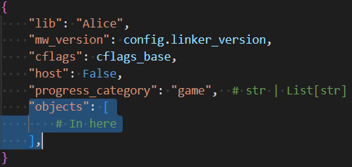

## Decompiling the code
Configure and build the project using the following commands
- `python3 configure.py -v [GAME ID]`
- `ninja`

This will generate `.s` (assembly) files inside the `build/[GAME ID]/asm` folder
- Each `.s` assembly file here corresponds to 1 file of source code

- Pick a function from one of the assembly files that has not yet been decompiled
- Place the function contents into a new scratch in [decomp.me](https://decomp.me)
    - Alternatively, or in conjunction, you can use [objdiff](https://github.com/encounter/objdiff/releases/latest) to view target and source assembly, and see the match percentage
    - You can also use objdiff to directly create a new scratch with preloaded config on [decomp.me](https://decomp.me)
- Write C++ code that creates matching assembly code
    - Use the following string as the build flags
    - Compiler `4.3 build 151 (Wii MW 1.1)`
    - `-opt level=4,schedule,speed,peep -RTTI off -enum int -fp hard -enc SJIS -fp_contract on -str reuse -inline auto -use_lmw_stmw on`

### Configuring new code files
- Add a new entry to the `objects` list within the lib named `Alice` within the `configure.py` file
    - For example `Object(MatchingFor("SALP4Q"), "Alice/Objects/Logic/CKAliceGameSpawnPoint.cpp")`
    - 
- Take the start and end address for the executable section from the chosen assembly file, and add a new entry to `config/[GAMEID]/splits.txt`
    - For example
    ```
    Alice/Objects/Logic/CKAliceGameSpawnPoint.cpp:
        .text       start:0x800EEFBC end:0x800EF814
    ```

### Configuring new symbols
- After writing a new function or variable, find the address of that symbol (in the assembly file, or Ghidra etc)
- Find the mangled name of the built symbol
    - You can use objdiff, right click on the symbol in the base target, and click copy the mangled name (for example `getClassID__21CKAliceGameSpawnPointFv`)
- Rename the symbol name at the address in `config/[GAMEID]/symbols.txt` to the mangled name
    - This is required for objdiff to report match progress

### Submitting PRs (Pull Requests)
- Please provide screenshots of the progress report output
- If applicable, you may also provide screenshots of objdiff, or a link to the [decomp.me](https://decomp.me) scratch
