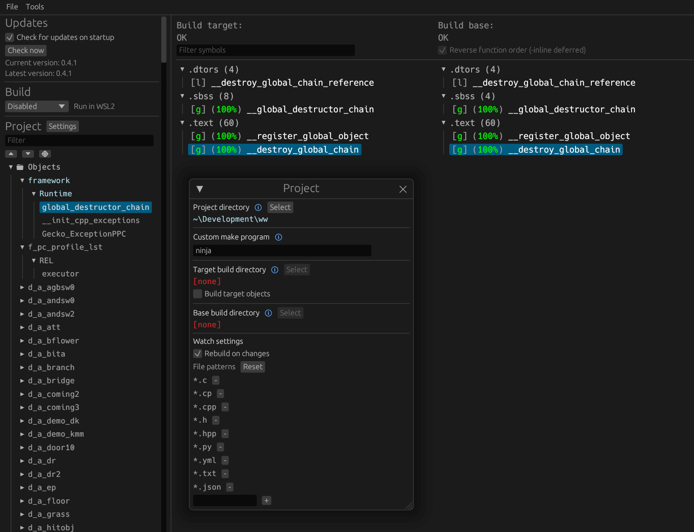

Alice in Wonderland (2010)  
[![Build Status]][actions] ![SALP4Q] ![SALE4Q] [![Discord Badge]][discord]
=============

<!--
Replace with your repository's URL.
-->
[Build Status]: https://github.com/Alice-2010/Decomp/actions/workflows/build.yml/badge.svg
[actions]: https://github.com/Alice-2010/Decomp/actions/workflows/build.yml
<!---
DOL progress URL:
https://progress.decomp.club/data/[project]/[version]/dol/?mode=shield&measure=code
URL encoded then appended to: https://img.shields.io/endpoint?label=DOL&url=
-->
[SALP4Q]: https://img.shields.io/endpoint?label=SALP4Q&url=https%3A%2F%2Fprogress.decomp.club%2Fdata%2Faliceinwonderland%2FSALP4Q%2Fdol%2F%3Fmode%3Dshield%26measure%3Dcode
[SALE4Q]: https://img.shields.io/endpoint?label=SALE4Q&url=https%3A%2F%2Fprogress.decomp.club%2Fdata%2Faliceinwonderland%2FSALE4Q%2Fdol%2F%3Fmode%3Dshield%26measure%3Dcode
<!--
Replace with your Discord server's ID and invite URL.
-->
[Discord Badge]: https://img.shields.io/discord/1068979192886198322?color=%237289DA&logo=discord&logoColor=%23FFFFFF
[discord]: https://discord.gg/CsKhC3HESA

A work-in-progress decompilation of Alice in Wonderland (2010 Wii).

This repository does **not** contain any game assets or assembly whatsoever. An existing copy of the game is required.

Supported versions:

- `SALE4Q`: NTSC (USA)
- `SALP4Q`: PAL (Europe)

Dependencies
============

Windows
--------

On Windows, it's **highly recommended** to use native tooling. WSL or msys2 are **not** required.  
When running under WSL, [objdiff](#diffing) is unable to get filesystem notifications for automatic rebuilds.

- Install [Python](https://www.python.org/downloads/) and add it to `%PATH%`.
  - Also available from the [Windows Store](https://apps.microsoft.com/store/detail/python-311/9NRWMJP3717K).
- Download [ninja](https://github.com/ninja-build/ninja/releases) and add it to `%PATH%`.
  - Quick install via pip: `pip install ninja`

macOS
------

- Install [ninja](https://github.com/ninja-build/ninja/wiki/Pre-built-Ninja-packages):

  ```sh
  brew install ninja
  ```

- Install [wine-crossover](https://github.com/Gcenx/homebrew-wine):

  ```sh
  brew install --cask --no-quarantine gcenx/wine/wine-crossover
  ```

After OS upgrades, if macOS complains about `Wine Crossover.app` being unverified, you can unquarantine it using:

```sh
sudo xattr -rd com.apple.quarantine '/Applications/Wine Crossover.app'
```

Linux
------

- Install [ninja](https://github.com/ninja-build/ninja/wiki/Pre-built-Ninja-packages).
- For non-x86(_64) platforms: Install wine from your package manager.
  - For x86(_64), [wibo](https://github.com/decompals/wibo), a minimal 32-bit Windows binary wrapper, will be automatically downloaded and used.

Building
========

- Clone the repository:

  ```sh
  git clone https://github.com/Alice-2010/Decomp.git
  ```

- Using [Dolphin Emulator](https://dolphin-emu.org/), extract the game's DATA partition, and place the `DATA/sys/main.dol` file into `orig/[GAMEID]/sys`.

- Configure:

  ```sh
  python configure.py -v [GAMEID]
  ```
  - If `-v [GAMEID]` is not specified, `SALP4Q` will be used

- Build:

  ```sh
  ninja
  ```

Diffing
=======

Once the initial build succeeds, an `objdiff.json` should exist in the project root.

Download the latest release from [encounter/objdiff](https://github.com/encounter/objdiff). Under project settings, set `Project directory`. The configuration should be loaded automatically.

Select an object from the left sidebar to begin diffing. Changes to the project will rebuild automatically: changes to source files, headers, `configure.py`, `splits.txt` or `symbols.txt`.



## References
- [Decomp Toolkit](https://github.com/encounter/dtk-template) (repo template)
- [Dolphin 2001 SDK](https://github.com/doldecomp/dolsdk2001)
- [MSL Runtime](https://github.com/projectPiki/pikmin2/blob/main/src/Dolphin/Runtime) (From Pikmin 2 Decomp)
